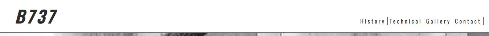
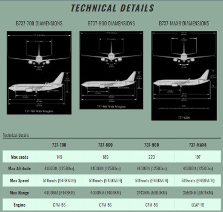

# BOEING 737

The initial idea for this website came from the fact that there are a lot of aviation enthousiasts out there who constantly looking to learn more about aviation and aircraft so I decided to build this website to give some historic facts and basic technical details about the Boeing 737, one of the most used aircraft in the world. Altought, there plenty websites available with a lot of information about aircraft, this website is looking to present all these inforamtion not only by reading but also through images and videos.  

## Features 

The website consists of one page which can be scrolled down to view all the content. The landing page has a big hero image which is aiming to attract immediately the attention of the user and invite the user to scroll further down for more information. On the right top corner of the header there is a navigation bar, which can be used to easily navigate to any part of the website. Also, in the bottom right corner there is a Home Button, fixed in position, which when pressed it takes the user all the way up to the header, where the navigation bar is, and further selections can be made. Below the landing page, is the History section where the history of the aircraft is described. Also, some videos are included to give further information. Scrollind further down the user can enjoy some very engaging and informative pictures about the technical characteristic of the mostly used variants of the Boeing 737 and a table which presents the performance characteristics of those variants. Before reaching the Footer, the user can watch images of all Boeing 737 variants in the gallery section and which can be opened in a seperated tab for better viewing. Lastly, in the Footer, the user can send a message to the website and also send some of the pictures that the user might have to the website throught the social media, which can be accessed by clicking on the social media icons.

 

### Existing Features

- __Navigation Bar__

  - The navigation bar at the top right corner of the website, is fully responsive and provides an easy way to the user to navigate througout the different sections.
  - Part of the navigation bar is the home button, which has fixed position on the right of the page and slightly above the bottom, to give the option and the flexibilitty to the user to go directly to the navigation bar to make other selections. 

- __Landing page__ 

- The landing page has an big hero image wich is very enageging and immediatetly the user can understand what the website is about.

- __History Section__
  - In the history section a brief history of the evolution of the aircraft is described and when each model was built, present like a magazine page in a 2 column configuration, where on smaller screens is presented as a sinlge column.
  - It has a picture of a Boeing 737 where it's 2 big modern engines are shown and at the bottom of page there 2 videos, one showing the evolution of the aircraft in pictures and the other one how the aircraft is built.

  

- __Technical Section__
  - The technical section presents the dimensions and the performance characteristics of the most used variants of the Boeing 737.
  - The 3 pictures show the dimensions of the aircraft, and when clicked they open in anew tab for better viewing, where the table presents the performance characteristics.
  - This section is fully responsive and on small screens the 3 pistures and the table will appear in one column. The table has an overlow propeerty, which will allow the user to scroll horizontally to see all the information.

  

- __Gallery section__
  - The gallery is fully responsive as well and shows a picture of all models variants of the Boeing 737, with a cover text on each pictures showing the model that is shown. When the pictures are clicked they open in a new tab for better viewing.
  - One smaller screens the pictures are shown in a single column and as the screen expands the pictures are spread into more columns in order to take any extra space.
  - There is a hover feature which allows the user to see what picture is about to select or has been selected

- __The footer__
  - In the footer section can be found a contact form and social media links.
  - The user can click any of the social media icons and can send there an picture that might have and wants to share it with the website. (*) There are no social media pages created yet, that's why when social media icons are click the links takes the user to the home page of those social media. 
  - The contact form can be used to send any message to the website developer. (*) Once the form is sumbited the user is taken to the [Code Institute-form dump](http://formdump.codeinstitute.net)

### Features Left to Implement

Due to lack of time, I wasn't able to make the gallery photos to have the same diamensions. Also, I would like to have creted a page which the user can see when they sumbit a messaege via the contact form.
   

## Testing
  - I tested the website in Chrome and Microsoft Edge browser to see that all pages loaded and that every link, button, form, image and navigation menu was working
  - The site is also responsive which I tested in google chromes devtools by selecting different screensizes and test each function
  - I tested that all text is easy to read and to understand

### Validator Testing
  - HTML Validator 
  - CSS Validator 
  - Lighthouse Desktopo Report 
  - Lighthouse Mobile Report 

### Unfixed bugs
 - No unfixed bugs found.

## Technology Used
  - The social media icons and the icons in history section were taken from [Font Awesome](https://fontawesome.com/account) 
  - The favicon was creted and generated in the [faicon.io](https://favicon.io/favicon-generator/)
  - The fonts used are 'Poppins'and 'Oswald', from [Google Fonts](https://fonts.google.com/)
  - To optimize the images [GIMP](https://www.gimp.org/) was used.
  - To optimize the videos [HandBrake](https://handbrake.fr/) was used.
  - For the color selection of the website [ColorSpace](https://mycolor.space/) was used.

## Wireframes

   Below you can see the initial idea regarding the design of the pages.
   - Initially the navigation bar was position in the middle under the hero image but it was destracting the user from the hero image.
   - The contact form initially was a seperate page but didn't look nice and failed to connect well with the rest of the webpage, so by placing to the footer blended nicer.

## Deployment 
- The site was deployed to GitHub pages. The steps to deploy are as follows: 
  - In the GitHub repository, navigate to the Settings tab 
  - From the source section drop-down menu, select the Master Branch
  - Once the master branch has been selected, the page will be automatically refreshed with a detailed ribbon display to indicate the successful deployment. 

The live link to GitHub can be found here - https://github.com/parides55/get-to-know-the-b737

The link to the website is - https://parides55.github.io/get-to-know-the-b737/

## Credits
 
 ### Media and Content
 - The images were taken from Google search.
 - THe videos are from https://www.youtube.com/watch?v=liZ0WEEsuz4&list=PPSV and https://www.youtube.com/watch?v=KzmF-AYk81Q&list=PPSV. 
 - The pictures for aircraft dimensions and the data in the technical table were taken from the Fligth Crew Operation Manual (FCOM) of the aircraft.
- The content of the history section was found in https://en.wikipedia.org/wiki/Boeing_737

### Code
- The code to make the navigation bar responsive and to create the doggle button on small screens was taken form the [Love Running Project-Toggle Button](https://learn.codeinstitute.net/courses/course-v1:CodeInstitute+LRFX101+2023_Q2/courseware/e805068059af42af87681032aa64053f/7525117e5cd144daa2a7b0c57843bbee/?child=first)
- The code to style and make the table responsive was taken form [W3School-Responsive Table](https://www.w3schools.com/css/tryit.asp?filename=trycss_table_responsive) and [W3School-Styling the table](https://www.w3schools.com/css/css_table_style.asp)
- The code to make the gallery responsive was taken from the [Love Running project-Gallery](https://learn.codeinstitute.net/courses/course-v1:CodeInstitute+LRFX101+2023_Q2/courseware/e805068059af42af87681032aa64053f/391954f5ae8547e180a539c0d51e063c/)
- The hoover feature of the gallery was taken from the [W3School-Gallery](https://www.w3schools.com/css/tryit.asp?filename=trycss_image_gallery)

<strong> Many thanks to my mentor Okwudiri for his guidance and isnpiration. A big thank you to my wife for her support and honest opinions :) 
 